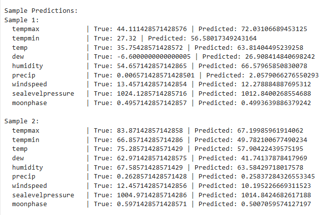
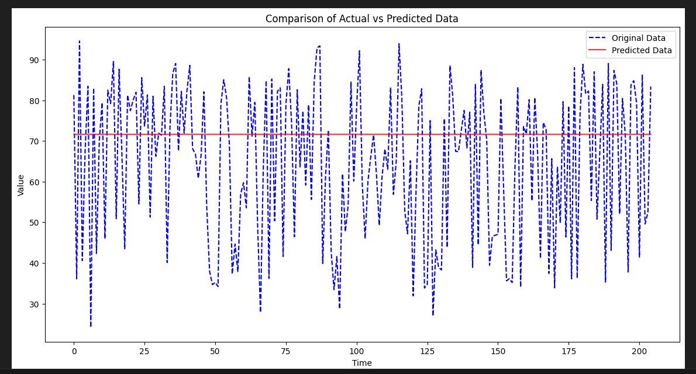
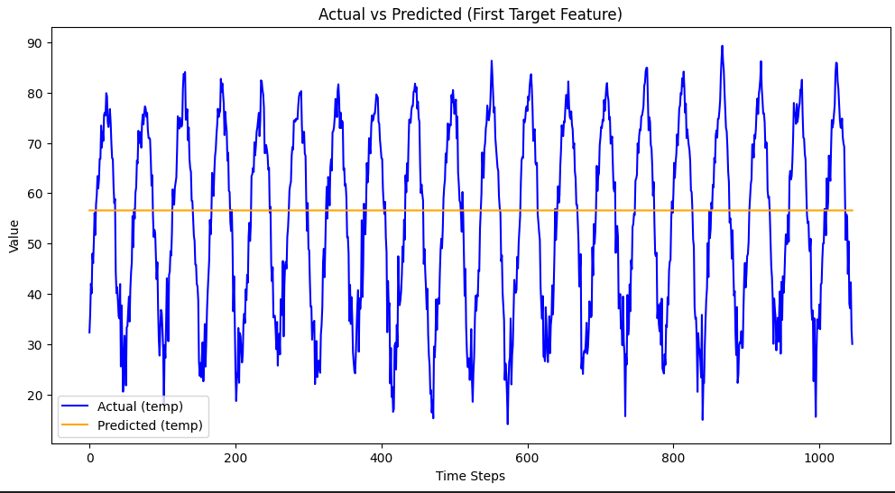
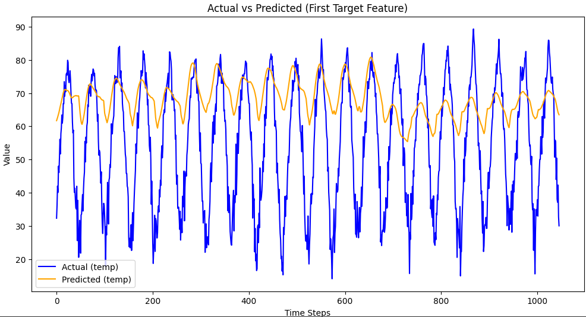
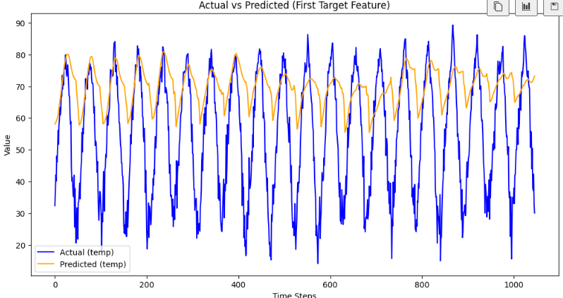
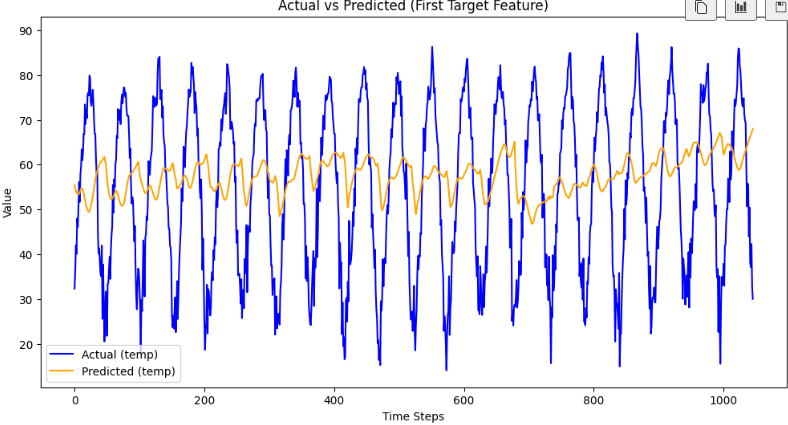
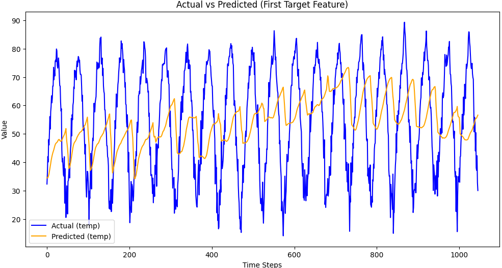
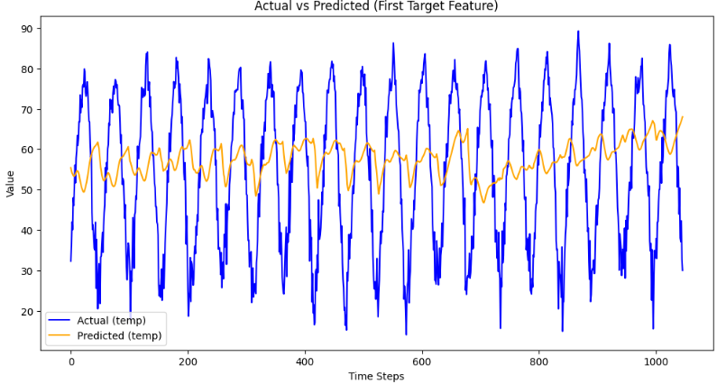
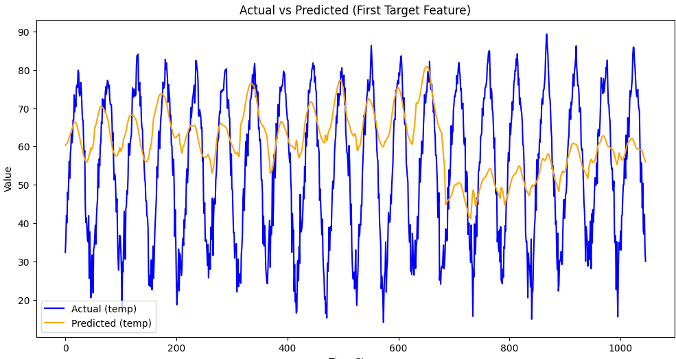

## AI 개발 과정

### 1. datapreprocessing을 통해 뉴스데이터 재가공

1. 뉴스 데이터와 기후 데이터가 같은 날끼리 연관 관계가 높을 수 있으니 같은날끼리 데이터를 병합
2. +n 주 만큼 차이가 났을 때 연관관계가 높을 수 있으니 +n일 만큼 더한 날끼리 데이터를 병합

위 데이터들을 한폴더에 저장


### 2. machineLearning에서 뉴스데이터를 통한 회귀모델 개발 진행

```python
model = Sequential([
        LSTM(256, activation='tanh', return_sequences=True, input_shape=(2, X_train.shape[2])),
        Dropout(0.12),
        LSTM(128, activation='tanh', return_sequences=False),
        Dropout(0.12),
        Dense(128, activation='relu'),
        Dropout(0.12),
        Dense(64, activation='relu'),
        Dropout(0.12),
        Dense(32, activation='relu'),
        Dropout(0.12),
        Dense(len(y_columns))  # 출력 노드 수는 y_columns의 수와 동일
    ])
```

다중 레이어와 시계열 데이터를 감안한 LSTM&Dense 복합 레이어 사용을 통해 데이터 예측 모델 개발

예측 데이터와 실제데이터 결과값이 매우 많이 차이남



데이터가 상관관계 분석을 하였을 때도 상관관계에서 유의미성을 찾지 못함

=> 뉴스데이터가 날씨데이터에 영향을 줄 수 없다는걸 알 수 있음


### 3. 데이터 재 수집, 재가공 및 상관관계 분석

#### 1.영향을 줄만한 데이터들 추가 수집

- **에너지 사용량**
- **공기 오염량**
- **인구수**
- **온실가스 배출량**


#### 2. 주단위로 데이터 파싱 및 경로 재지정


#### 3. 데이터가 시계열적 특성을 띄는걸 모델 개발하면서 인지, 해당 특성을 반영할 수 있는 상관관계 분석에 대해 탐색

- **교차상관분석** : 두 시계열 데이터 간의 시점별 관계를 평가하는 방법
  - 특징:
    - 목적: 시계열 데이터 간의 시간 지연 효과 또는 선후 관계를 분석.
    - 산출물: 시간 지연(또는 선도)에 따른 상관계수 값.
    - 응용:
      - 경제 데이터 분석(예: 주가와 금리의 관계).
      - 신호 처리(예: 입력 신호와 출력 신호의 시간적 관계).
      - 환경 데이터 분석(예: 강수량과 하천 수위).
  - 분석 절차:
    1. 두 시계열 데이터를 정규화하거나 동일한 스케일로 변환.
    2. 다양한 시간 지연(lag)을 적용하며 상관계수를 계산.
    3. 최대 상관계수가 발생하는 지연값(lag)을 확인.
- **Granger 인과 검정**: 한 시계열 데이터가 다른 시계열 데이터를 예측하는데 유의미한 정보를 제공하는지 판단
  - 특징:
    - 목적: 인과 관계(특히, "선도" 관계) 여부를 확인.
    - 산출물: 귀무가설("X는 Y를 예측하지 않는다")에 대한 p-value.
    - 응용:
      - 경제학에서 정책 변수와 경제 지표 간 관계 분석.
      - 금융에서 자산 간 상호 영향 분석.
      - 생물학에서 신호 간의 동적 관계 탐색.
  - 분석 절차:
    1. 데이터가 정상성(Stationarity)을 만족하도록 변환(차분 또는 로그 변환).
    2. 최적의 지연(Lag) 값을 결정.
    3. Granger 검정 수행:
       - 귀무가설: X는 Y를 예측하지 않는다.
       - 대립가설: X는 Y를 예측한다.
- **공적분 히트맵 분석** : 두 개 이상의 비정상 시계열이 일정한 비율로 선형 결합될 때 정상성을 가지는 관계를 가지는지 판단
  - 특징:
    - 목적: 시계열 데이터 간의 장기적인 균형 관계를 확인.
    - 산출물: 공적분 테스트 결과를 기반으로 한 히트맵.
    - 응용:
      - 금융: 주식 간의 장기적 동조성 분석.
      - 경제학: 상품 가격 간의 장기적 관계 분석.
      - 환경 데이터: 기후 변수 간의 상호작용 탐색.
  - 분석 절차:
    1. 데이터가 비정상적(non-stationary)인지 확인 (ADF 또는 KPSS 테스트).
    2. 공적분 관계를 Johansen 공적분 검정 등으로 평가.
    3. 데이터 간 공적분 계수 및 검정 결과를 히트맵으로 시각화.


#### 4. 분석 시행

- **결과**: 교차상관과 공적분 히트맵 분석에서는 상관관계가 없고 granger 인과검정에서만 상관관계가 나옴
- **분석**: 교차상관분석과 공적분 히트맵 분석에서 상관관계가 없는데 **Granger 인과검정에서만 관계가 나타나는 상황**은 두 시계열 간의 관계가 **시간적 방향성**이나 **동적 구조**를 통해서만 드러나고, 단순한 상관관계나 장기적 균형 관계로는 설명되지 않는다는 것을 의미
  - **교차상관분석에서 관계가 없는 경우**
    - 교차상관분석은 시계열 간의 **선형적 상관관계**를 확인하지만, 이는 데이터 간의 즉각적이거나 특정 지연(lag)에서 나타나는 단순한 통계적 상관성에 초점을 둠
    - Granger 인과관계는 **변수 간의 동적 예측력**을 평가하므로, 데이터가 단순히 시간 지연에 따른 상관성을 나타내지 않는 경우에도 인과성을 보일 수 있음
  - **공적분 히트맵에서 관계가 없는 경우**
    - 공적분은 시계열 데이터 간의 **장기적인 균형 관계**를 평가함
    - 공적분 관계가 없다는 것은 두 시계열이 시간이 지남에 따라 함께 움직이는 **장기적인 안정된 경향**이 없음을 의미
    - 그러나 Granger 인과검정은 시계열 간의 **단기적이고 방향성 있는 정보 교환**에 중점을 둠
  - **Granger 인과관계만 존재하는 경우**
    - Granger 인과관계는 한 시계열이 다른 시계열의 **미래 값을 예측**하는 데 도움이 되는지를 검증.
    - 따라서 데이터 간의 관계가 단순히 동시적으로 나타나거나 장기적 균형에 있지 않더라도, **시간 지연 구조를 통해 예측력이 존재**할 수 있음
    - 이는 데이터가 **동적 상호작용**을 통해 영향을 주고받는 상황을 반영함
- **이 상황이 시사하는 바:**
  1. **즉각적이거나 단순한 상관관계가 아닌 동적 관계 존재**
     두 변수는 단순히 상관관계를 보이지 않지만, **시간적 지연을 통해서 한 변수가 다른 변수에 영향을 미치거나 예측력**을 제공하고 있을 가능성이 큽니다.
  2. **단기적 예측 관계가 장기적 균형 관계로 이어지지 않음**
     Granger 인과관계는 단기적인 시점에서의 방향성을 보여주지만, 공적분 관계가 없다는 것은 이 관계가 장기적인 패턴으로 정착되지 않음을 의미합니다.
     - 예: 경제 변수 간의 정책 효과가 단기적으로는 영향을 미치지만, 시간이 지남에 따라 그 관계가 사라질 수 있음.
  3. **비선형적이거나 복잡한 관계일 가능성**
     교차상관분석에서 상관관계가 없다는 것은 데이터 간의 관계가 단순 선형적이지 않을 가능성을 시사합니다. 이 경우 Granger 인과관계는 비선형적 또는 복잡한 지연 효과를 포착할 수 있습니다.


### 4. LSTM 폴더에서 개발 진행

#### **1. 데이터 준비**

- 뉴스, 기후, 에너지, 공기 오염 등의 데이터를 병합하여 시계열 데이터를 구성.
- 데이터는 주단위로 정리되며, 과거 30주의 데이터를 입력(LSTM의 시퀀스)으로 사용하도록 설계.
- 타겟 데이터(y)와 입력 데이터(X)를 분리한 후, 시계열 윈도우 생성 함수(`create_time_series_features`)를 통해 입력 데이터셋(X_ts, y_ts)을 생성.


#### **2. LSTM 모델 정의**

- LSTM 모델은 시계열 데이터의 특성을 반영한 다층 구조로 설계.

  ```
  python코드 복사model = Sequential([
      LSTM(256, activation='tanh', return_sequences=True, input_shape=(30, X_train.shape[2])),
      Dropout(0.12),
      LSTM(128, activation='tanh', return_sequences=False),
      Dropout(0.12),
      Dense(128, activation='relu'),
      Dropout(0.12),
      Dense(64, activation='relu'),
      Dropout(0.12),
      Dense(32, activation='relu'),
      Dropout(0.12),
      Dense(len(y_columns))  # 출력 노드 수는 y_columns의 수와 동일
  ])
  ```


#### **3. 부트스트랩 학습**

- 부트스트랩 학습(`bootstrap_training`)을 통해 데이터가 적은 상황에서도 모델의 학습 안정성을 확보.
- 부트스트랩은 원 데이터에서 중복을 허용한 샘플링을 통해 여러 데이터셋을 생성하며, 이를 기반으로 여러 모델을 독립적으로 학습.
- 학습 중 EarlyStopping을 사용하여 과적합을 방지.
- `n_bootstrap=10`으로 설정하여 10개의 부트스트랩 모델을 학습.


#### **4. 앙상블 예측**

- 학습된 부트스트랩 모델들의 예측 결과를 평균내어 최종 결과를 생성.
- 앙상블은 단일 모델 대비 예측의 안정성과 정확도를 향상시키는 역할.


#### **5. 성능 평가**

- Mean Absolute Error (MAE)와 Mean Squared Error (MSE)를 사용하여 모델의 성능을 평가.
- 부트스트랩 학습의 결과로 각 모델의 최적 Validation Loss를 비교하여 성능 확인.


#### **6. 데이터 복원 및 시각화**

- 예측 결과와 실제값을 시계열 데이터 상에서 비교.
- 데이터의 원래 형태를 복원하는 함수와 시각화를 통해 LSTM 모델의 시계열 예측 성능을 평가.


#### 7. 결과 분석

##### **1. 결과 요약**

- LSTM 모델을 사용하여 시계열 데이터를 예측한 결과, 모델은 데이터의 전반적인 추세를 제대로 반영하지 못하며, **예측값이 지나치게 선형적**으로 나타나는 경향이 있음.
- 아래 그래프는 **실제 데이터(파란 점선)**와 **모델이 예측한 데이터(빨간 선)**를 비교한 것입니다. 실제 데이터는 급격한 변동을 보이지만, 모델은 이를 제대로 추적하지 못하고 평균값에 가까운 예측값을 반복적으로 생성하는 모습을 보여줍니다.



##### **2. 문제점 분석**

1. **모델의 선형적 경향**
   - 모델이 시계열 데이터의 비선형적 패턴이나 급격한 변화(피크와 밸리)를 학습하지 못하고, 데이터의 평균적인 값을 예측하려는 경향이 강하게 나타남.
   - 이는 LSTM 모델의 깊이나 복잡성이 충분하지 않거나, 데이터의 중요한 패턴을 제대로 학습하지 못했음을 나타냄.
2. **스케일링 적용 및 파라미터 튜닝 결과**
   - 데이터를 `scaler`(예: MinMaxScaler, StandardScaler)를 이용하여 정규화하고, 시계열 윈도우를 생성하여 입력값의 품질을 개선하려는 시도를 했음.
   - 또한, LSTM 모델의 **은닉층 크기, 드롭아웃 비율, 학습률 등 하이퍼파라미터**를 조정하여 학습 성능을 개선하려 했으나, 결과적으로 예측 성능에는 큰 차이가 없었음.
3. **시계열 특성과 모델 설계 간의 부조화**
   - 시계열 데이터의 특징(급격한 변화나 피크)을 반영하지 못한 모델 구조일 가능성이 있음.
   - LSTM의 깊이 및 추가적인 특성 추출 레이어 부족으로 인해 데이터의 **동적 패턴**을 제대로 학습하지 못했을 가능성이 높음.
4. **데이터의 복잡성과 양적 부족**
   - 시계열 데이터가 갖는 **내재적 노이즈**와 **데이터 부족**이 모델 학습의 성능 한계로 작용했을 가능성.
   - 부트스트랩 방식을 통해 데이터 양을 간접적으로 늘리는 방법을 사용했으나, 이 역시 모델의 성능에 큰 영향을 미치지 못함.

### 7. 결과 분석

#### **1. 결과 요약**

- LSTM 모델을 사용하여 시계열 데이터를 예측한 결과, 모델은 데이터의 전반적인 추세를 제대로 반영하지 못하며, **예측값이 지나치게 선형적**으로 나타나는 경향이 있음.
- 아래 그래프는 **실제 데이터(파란 점선)**와 **모델이 예측한 데이터(빨간 선)**를 비교한 것입니다. 실제 데이터는 급격한 변동을 보이지만, 모델은 이를 제대로 추적하지 못하고 평균값에 가까운 예측값을 반복적으로 생성하는 모습을 보여줍니다.

------

#### **2. 문제점 분석**

1. **모델의 선형적 경향**
   - 모델이 시계열 데이터의 비선형적 패턴이나 급격한 변화(피크와 밸리)를 학습하지 못하고, 데이터의 평균적인 값을 예측하려는 경향이 강하게 나타남.
   - 이는 LSTM 모델의 깊이나 복잡성이 충분하지 않거나, 데이터의 중요한 패턴을 제대로 학습하지 못했음을 나타냄.
2. **스케일링 적용 및 파라미터 튜닝 결과**
   - 데이터를 `scaler`(예: MinMaxScaler, StandardScaler)를 이용하여 정규화하고, 시계열 윈도우를 생성하여 입력값의 품질을 개선하려는 시도를 했음.
   - 또한, LSTM 모델의 **은닉층 크기, 드롭아웃 비율, 학습률 등 하이퍼파라미터**를 조정하여 학습 성능을 개선하려 했으나, 결과적으로 예측 성능에는 큰 차이가 없었음.
3. **시계열 특성과 모델 설계 간의 부조화**
   - 시계열 데이터의 특징(급격한 변화나 피크)을 반영하지 못한 모델 구조일 가능성이 있음.
   - LSTM의 깊이 및 추가적인 특성 추출 레이어 부족으로 인해 데이터의 **동적 패턴**을 제대로 학습하지 못했을 가능성이 높음.
4. **데이터의 복잡성과 양적 부족**
   - 시계열 데이터가 갖는 **내재적 노이즈**와 **데이터 부족**이 모델 학습의 성능 한계로 작용했을 가능성.
   - 부트스트랩 방식을 통해 데이터 양을 간접적으로 늘리는 방법을 사용했으나, 이 역시 모델의 성능에 큰 영향을 미치지 못함.

##### **3. 결론 및 향후 개선 방향**

1. **모델 구조 개선**
   - LSTM 모델 외에도 **Transformer** 기반의 모델, GRU, 또는 Conv1D 기반의 시계열 모델을 적용해 **데이터 패턴의 복잡성을 더 잘 학습**할 수 있는 구조를 시도해야 함.
   - Multi-head Attention이나 Residual Connections을 추가해 **장기 의존성(long-term dependency)**과 **단기 변화(short-term dynamics)**를 동시에 학습할 수 있도록 설계 필요.
2. **데이터 전처리 강화**
   - 시계열 데이터에 대한 추가적인 전처리 및 피처 엔지니어링(예: 차분 데이터, 주기성 데이터 추가)을 통해 데이터 품질을 높이는 방안 검토.
   - 외부 데이터(기상, 경제적 지표 등)를 추가하여 모델이 활용할 수 있는 정보를 풍부하게 제공.


### 5. transformer에서 개발 재진행

#### 1. 일반 transformer 에서 재진행

- 개선점

  - 데이터 train, test 분할 후 슬라이딩 윈도우로 시계열 데이터 생성을 위한 차원 추가

  - 패러미터 재조정을 통해 모델 복잡성 수준 개선
    - d_model : 입력 데이터를 임베딩하여 Transformer의 내부 표현 차원을 정의
      -  128 -> 1024
    - nhead : 병렬로 여러 개의 어텐션을 학습해 다양한 데이터 패턴을 포착.
      - 8 -> 32
    - num_layers : 데이터 패턴을 깊게 학습하기 위해 Transformer의 계층 수를 정의
      - 5 -> 16

  - scaling process 적용

  - 손실함수 `MSELoss` 로 변경

- 결과값

  

  - LSTM으로 했을 때와 동일하게 선형적으로 예측값이 생성됨
  - 주기성 정보 변환과 Fourier 변환 적용, optimizer 변경을 개선점으로 생각함


#### 2. 1의 결과값을 통해 모델 개선

- 프로그램 동작 flow
  1. csv 파일 read
  2. positional encoding 과 이를 활용하는 WeatherTransformer 정의
  3. Nadam optimizer 구현
  4. 두 csv 파일 병합 및 데이터 전처리
     1. 시간 정보 추가
     2. 시간 정보 sin, cos 화하여 추가
     3. fourier 변환 데이터 추가
  5. 데이터 분할
  6. 슬라이딩 윈도우 프로세스 정의 
     - 윈도우 크기 7(7주)로 정의
  7. 모델 파라미터 정의
  8. 모델 학습
  9. 학습 모델 test

- 결과값

  

  - 분석 : 예측값의 변동폭이 실제값에 비해 작다는 것은 모델이 **데이터의 패턴을 충분히 학습하지 못했거나**, **과도한 정규화나 학습 제약**으로 인해 모델이 덜 민감하게 작동하고 있을 가능성이 있다고 함
  - 문제 해결 방법 분석:
    - 모델 구조 및 학습 변경
      - 모델 복잡도 증가
        - d_model: `1024` -> `1280`
        - nhead: `32` -> `64`
        - num_layers: `16` -> `20`
      - 드롭아웃 감소 : 드롭아웃 값이 너무 크면 모델이 덜 민감하게 작동 할수 있다 함
        - dropout: `0.1` -> `0.05`
      - Loss 함수 변경
        - 현재 MSE 사용중, 이는 큰 에러를 과도하게 강조하여 평탄한 예측을 만든다고 함
        - Huber Loss로 변경
    - 학습 과정 조정
      - 학습률 조정
        - 너무 낮으면 ㅁ모델이 패턴을 학습하지 못한다고함
        - learning_rate: `0.0002` -> `0.005`
      - epoch 수 증가
        - 현제 early stopping이 적용 되어 있으므로 크게 증가시켜도 과적합 문제가 발생할 확률 적음
        - epoch: `100` -> `200`
      - 배치 크기 조정
        - 배치크기가 너무 크면 모델이 데이터의 세부 패턴 학습이 안된다고 함
        - 그러나 현재 batch_size는 32로 적당해 보이므로 해당 파라미터 조정 X


#### 3. 2의 결과값을 통해 모델 개선

- 결과값

  - beta == 1.0

    
  
  - beta == 2.0
  
    - RMSE: 7.9794 
    - MAE: 6.6825
  
    
  
  - beta == 8.0
  
    - RMSE: 10.4185 
    - MAE: 8.3941
  
    
  
  - beta == 16
  
    - RMSE: 7.9794 
    - MAE: 6.6825
  
    
  
  - beta == 32
  
    - RMSE: 8.9354 
    - MAE: 7.2573
  
    
  
  

- 결과 분석
  - 확실히 beta 값이 오를 수록 그래프의 폭이 넓졌지만 그만큼 이상값을 너무 많이 고려하여 학습이 진행됨
  - beta값이 16일 때부터 예측 데이터가 실제 데이터 그래프의 개형을 무시하기 시작, 32에 이르러서는 예측값의 평균이 실제값의 평균을 무시하게됨
  - 학습을 돌릴 때마다 결과값이 계속 달라짐
  - 그래프의 폯도 달라져서 beta 값의 유의미한 관계를 잘 못찾겠음
- 개선 방안
  - 더 해야하나? 고민임...


